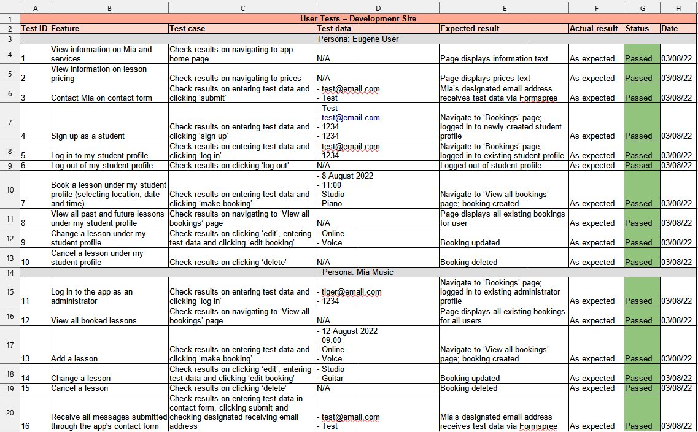
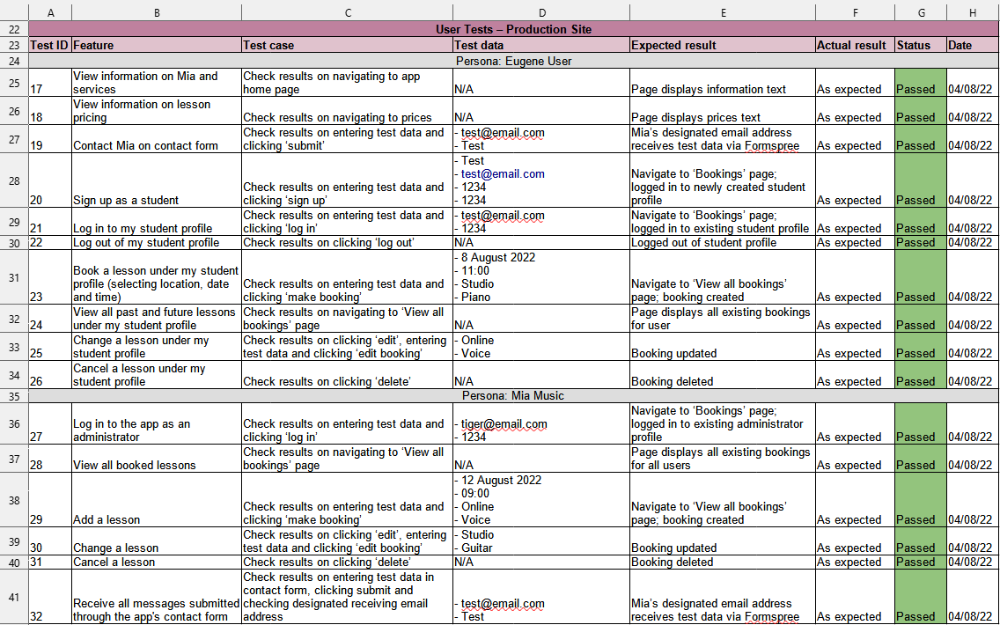
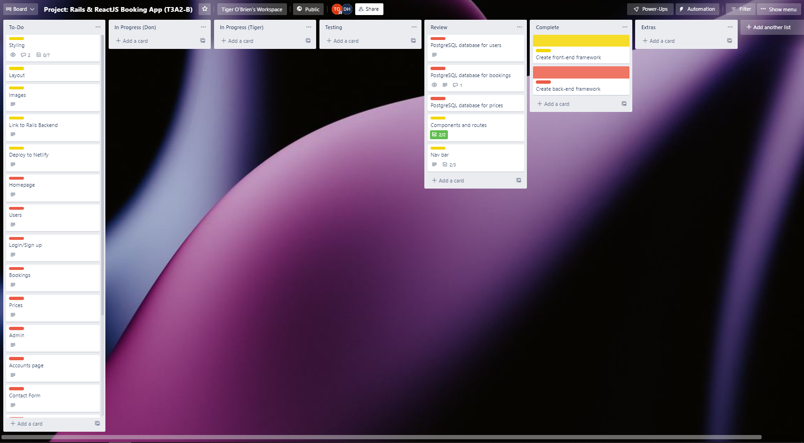
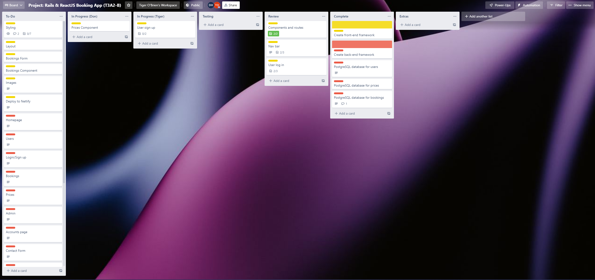
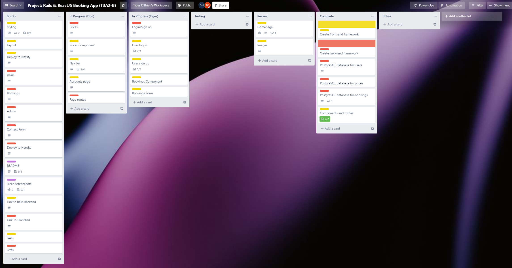
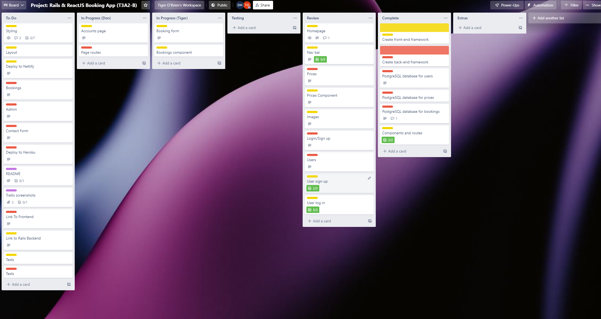
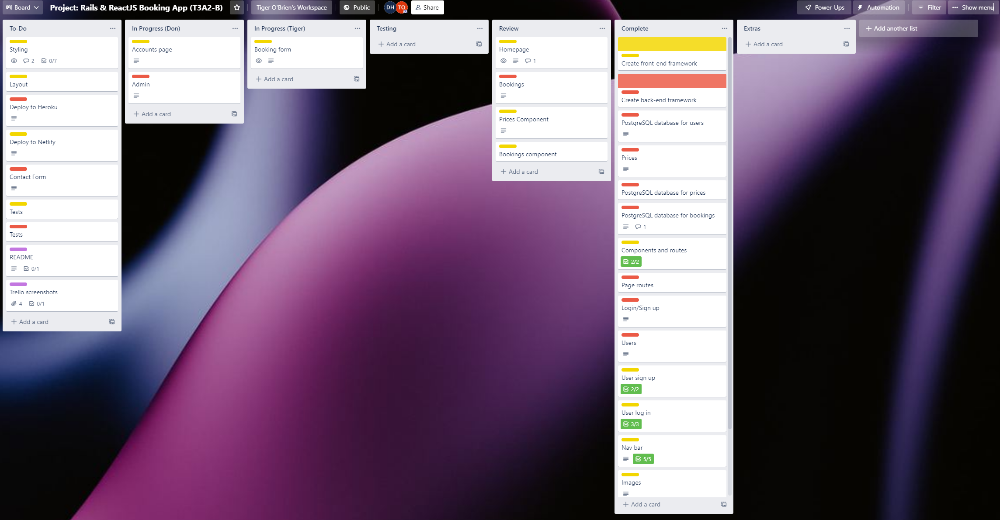
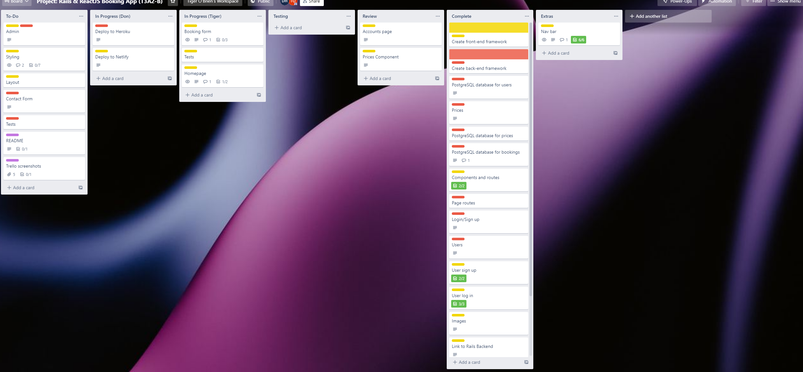
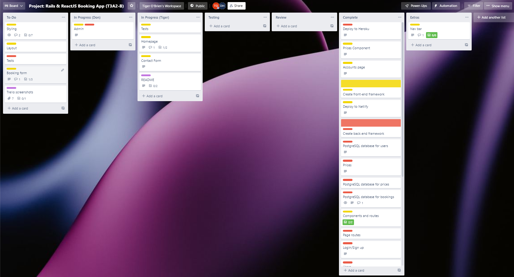
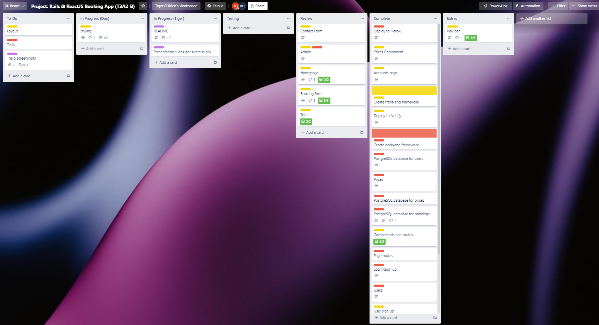

# Project: Rails & React Booking App - *Mia Music Bookings*

### Deployed website:

https://mia-music-studios.netlify.app/

### GitHub repository (back end):

https://github.com/Don-Heal/Mia_Music_Rails_Api

### GitHub repository (front end):

https://github.com/Don-Heal/Mia_Music_React

## Documentation Presented For T3A2-A

### Documentation:

https://github.com/tigerob/rails-reactjs-booking-app-project-documentation

## Further Documentation For T3A2-B

### Adjustments from T3A2-A

During the development phase, we further considered the needs of our hypothetical client against the scope of and time frame for this work. On balance, we made the following adjustments to the app:

- Added 'instrument' to the booking form. Users can select between 'guitar', 'piano' and 'voice' when booking a lesson.
- Minor cosmetic and layout choices.

### Testing

In addition to utilising a formal testing framework and writing test files, we also conducted extensive user testing of both the development site and production site.

We include records of that user testing below.

### Trello board

The project Trello board is available [here](https://trello.com/b/D6nQq4WS/project-rails-reactjs-booking-app-t3a2-b).

We include screenshots of this Trello board below.

