# Project: Rails & React Booking App - *Mia Music Bookings*

### Deployed website:

https://mia-music-studios.netlify.app/

### GitHub repository (back end):

https://github.com/Don-Heal/Mia_Music_Rails_Api

### GitHub repository (front end):

https://github.com/Don-Heal/Mia_Music_React

                                                * * * 

# Documentation Presented For T3A2-A

## Purpose

Our hypothetical client, Mia Music, is a teacher of guitar, piano and singing to students of all ages. She conducts her lessons both in person at her studio in Penny Lane, Melbourne, and virtually over Zoom to students at their homes.

Presently, her students book lessons with her variously by text message, phone call and email. Mia finds this part of her business to be labour-intensive and cumbersome for both her and her students.

Mia is looking for a solution that improves the booking experience for her and her students. She has engaged us to develop a full-stack web app through which:

1. Her students can book and manage their lessons
2. She can view and manage all of her lessons

## Functionality

### Users

- View information on Mia and her services
- View information on lesson pricing
- Contact Mia via a contact form
- Sign up as a student
- Log in to student profile
- Log out of student profile
- Book a lesson under student profile (selecting location, date and time)
- View all past and future lessons under student profile
- Change a lesson under student profile
- Cancel a lesson under student profile

### Owner

- Log in as administrator
- View all booked lessons
- Add a lesson
- Change a lesson
- Cancel a lesson
- Change the prices displayed for lessons
- Receive all messages submitted through the app's contact form

## Target audience

Our target audience comprises Mia and all of Mia's present and prospective music students. These students span all ages and demographics. Therefore, the app will need to be accessible to this wide audience.

## Tech stack

### Front end
- HTML
- CSS
- JavaScript
- ReactJS

### Back end
- Ruby
- Rails

### Database
- PostgreSQL

### Deployment
- Netlify (front end)
- Heroku (back end)

## Dataflow diagram

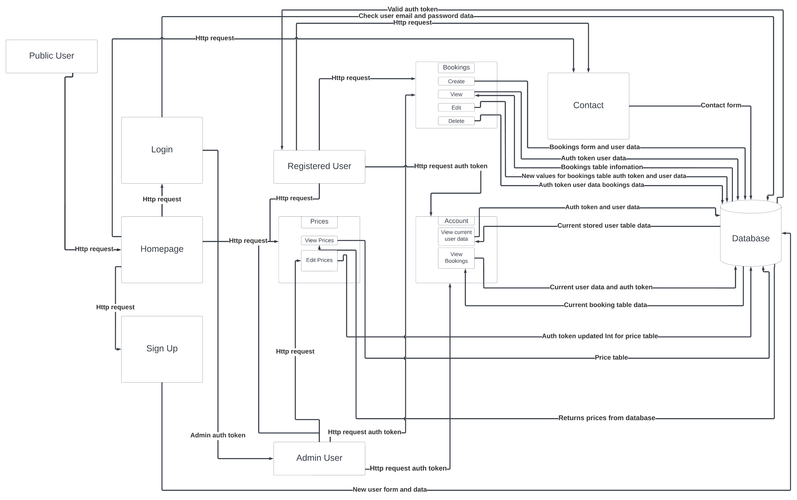

**Public User**

Can access:
- Homepage
- Login
- Sign up
- Prices
- Contact

Cannot access:
- All booking features
- Account information

**Login**
- Public Users will use valid credentials to log in to the site to access restricted parts of the website and receive a valid auth token.

**Sign Up**
- The app will take the Public User's valid and required information to create a new user in the database. The user will then be signed in and given a valid auth token.

**Registered User**

- Can do all that the Public User can do, plus create, view, edit and delete bookings associated with the currently logged-in user. Can also update and change their account information.

**Admin User**

- Can do all that the Registered User can do, plus can create, viewm edit, and delete any booking (not just those of a single user). Can also alter the lesson prices that are stored in the database.

**Prices**

- Can be viewed by all users and edited only by a the Admin User.

**Account**

- Can view current account information and update this account information in the database.

**Bookings**

- Valid users can create, view, edit and delete bookings associated with that user's account. The Admin User can access all bookings and create, view, edit and delete any of them.

**Contact**

- The contact form can be accessed by all users and information submitted will be stored in the database.

## Application architecture diagram

## User stories

**Persona one:** Eugene User is a 30-year-old professional who has been self-learning guitar for the past six months. He now wishes to see a teacher for guitar and, potentially, voice lessons once a week. He discovered Mia's website by searching online for teachers located in the Melbourne CBD.

**Persona two:** Mia Music is a teacher of guitar, piano and singing to students of all ages. She conducts her lessons both in person at her studio in Penny Lane, Melbourne, and virtually over Zoom to students at their homes.

As **Eugene**, I want to:

1. View information on Mia and her services so that I can assess whether she is the right teacher to help me achieve my goals
2. View information on lesson pricing so that I can assess whether these lessons fall within the appropriate financial range for me
3. Contact Mia via a contact form in order to ask her any questions I have before committing to booking a lesson
4. Sign up as a student so that I have a student profile from which to book and manage my lessons
5. Log in to my student profile so that I can book and manage my lessons
6. Log out of my student profile so that use of my profile is secure
7. Book a lesson under my student profile, including by selecting location, date and time, so that I can unilaterally plan and lock in my future lessons at locations, dates and times that suit me best
8. View all past and future lessons under my student profile so that I can check when my past lessons were or future lessons are in the event I need to recall that information
9. Change a lesson under my student profile so that I can reschedule lessons in the event my plans change and a different location, date or time would suit me better
10. Cancel a lesson under my student profile so that I can withdraw my commitment to undertaking a lesson if my plans change and it no longer suits me to attend that lesson

As **Mia**, I want to:

11.  Log in to the app as its administrator so that I can carry out the booking administration of my teaching business
12.  View all booked lessons so that I can be informed of all my lessons commitments and manage my work days accordingly
13.  Add a lesson so that I can record any lessons that I arrange outside of the app (for example, there may be instances where I still arrange lessons by conversing with a student)
14.  Change a lesson so that I can reschedule lessons in the event there is a need to do so and I know of a suitable location/date/time for reschedule
15.  Cancel a lesson so that I can withdraw my commitment to providing a lesson if my plans change and providing that lesson is not feasible or desirable
16.  Change the prices displayed for my lessons so that I can maintain up-to-date advertisements of my lesson prices if/when they change
17.  Receive all messages submitted through the app's contact form so that I can be informed of any messages from students or prospective students and act accordingly (for example, by calling them to discuss the prospect of lessons)

## Wireframes

### Homepage
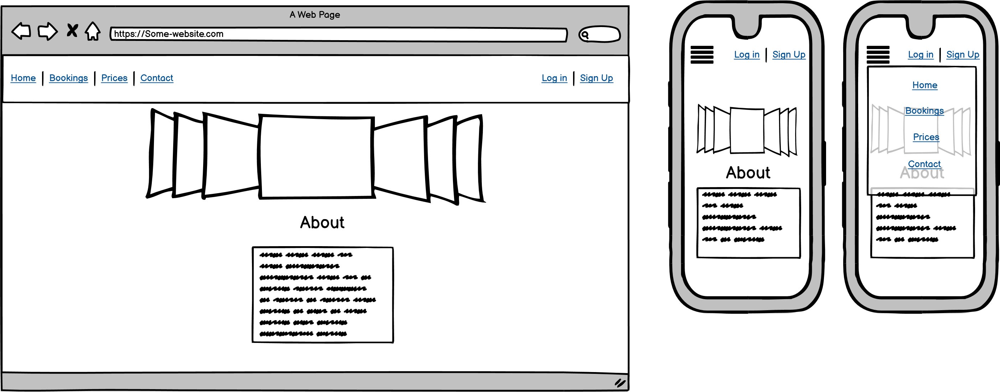

### Booking
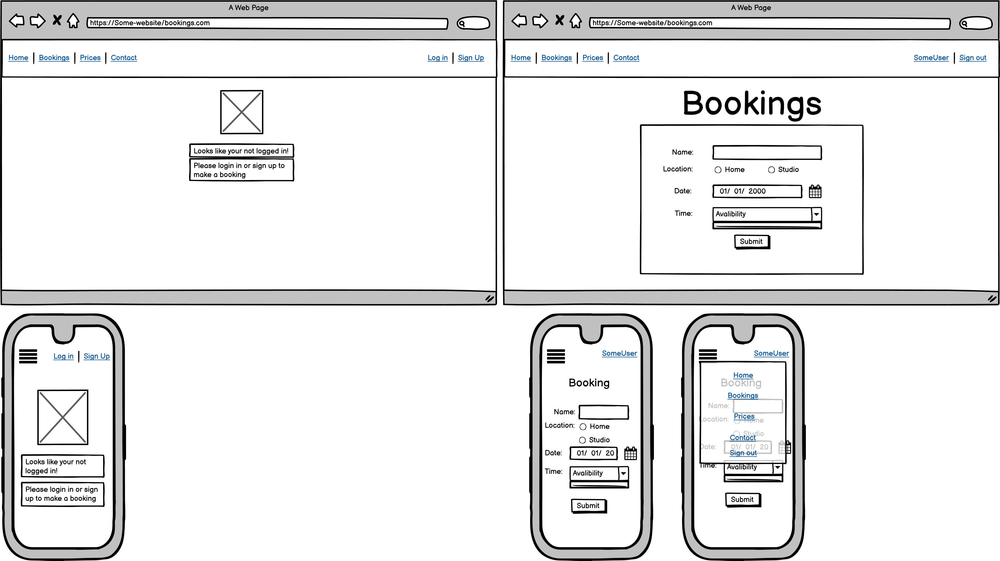

### Price
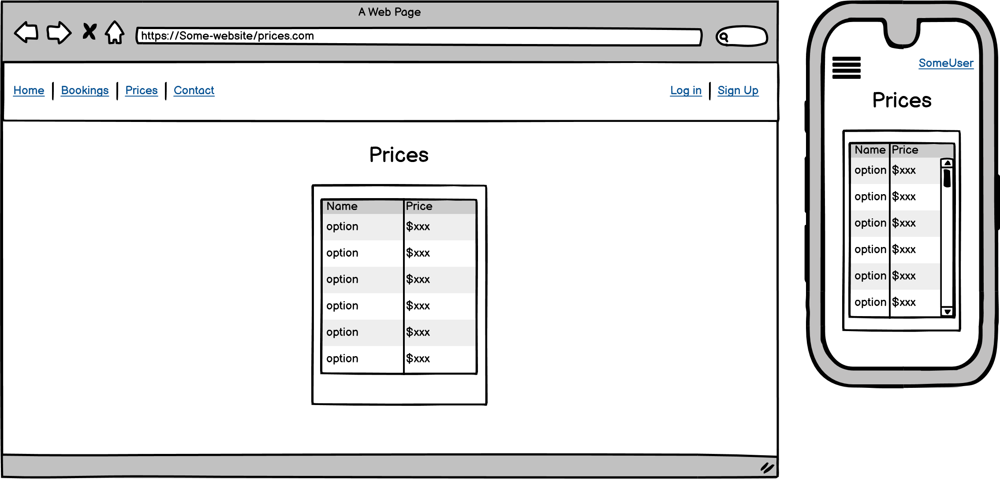

### Contact
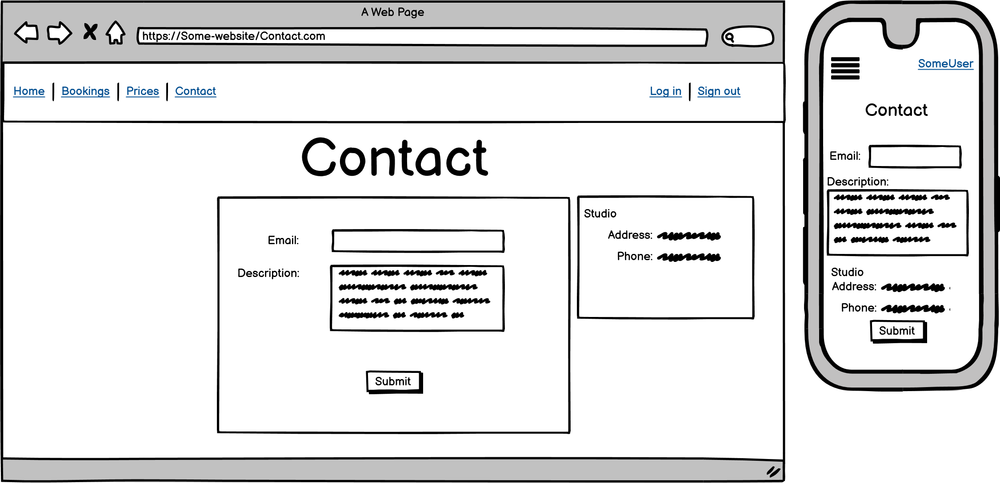

### Admin

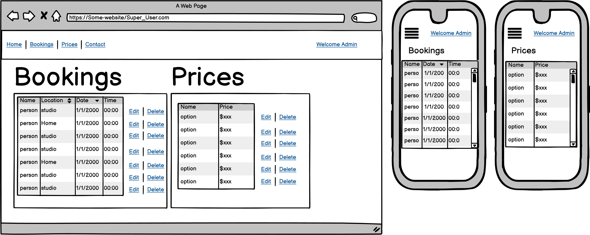

### User

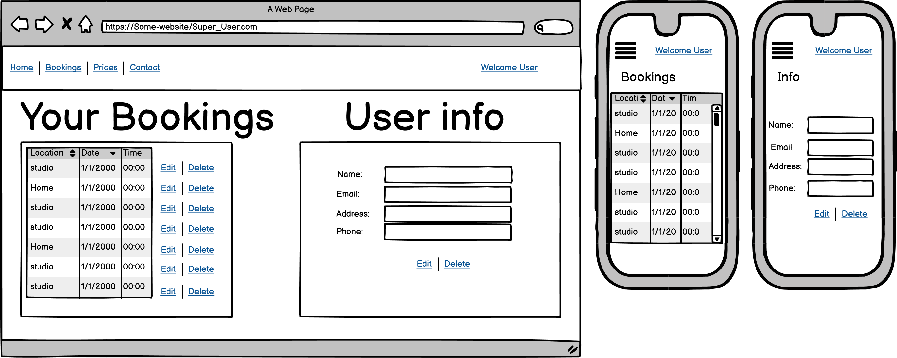

## Trello board

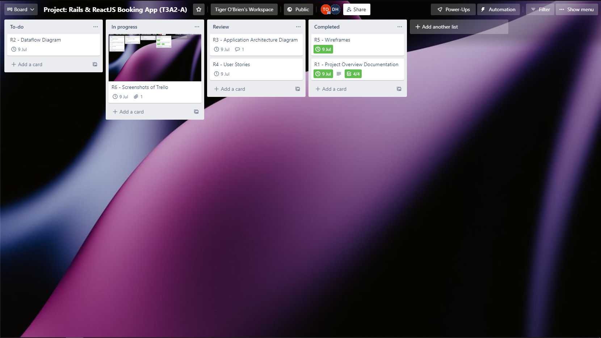
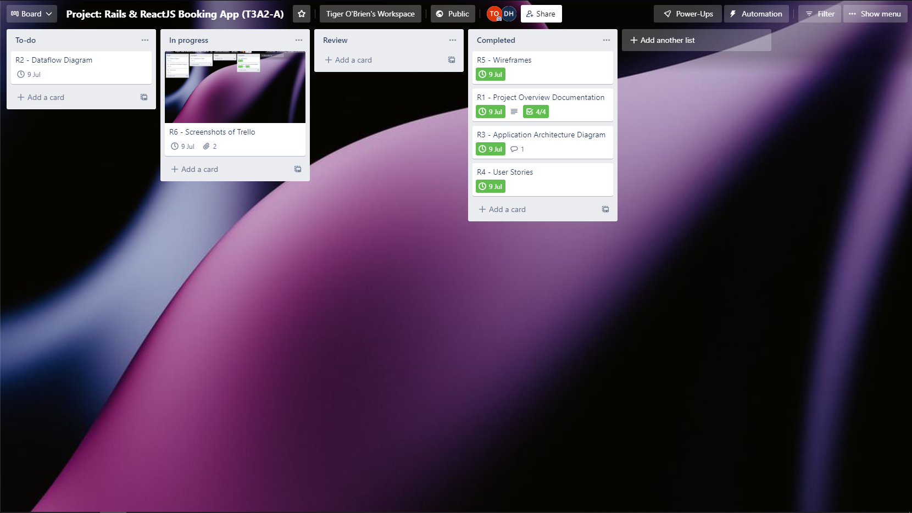
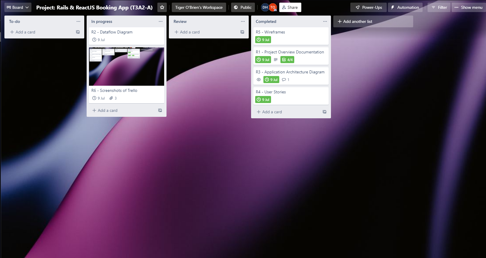
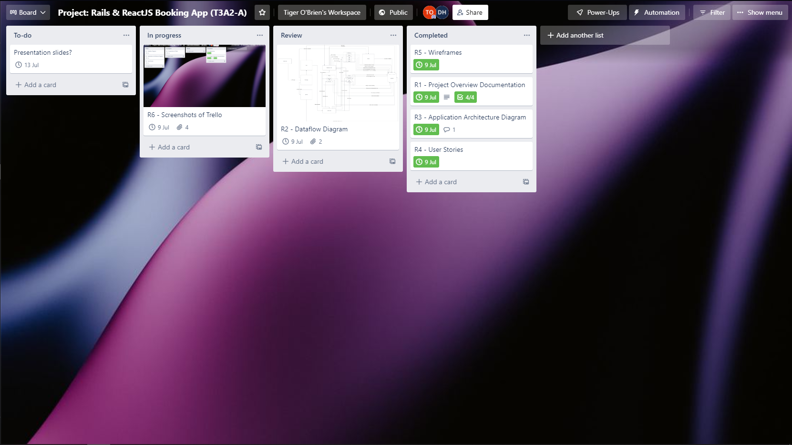
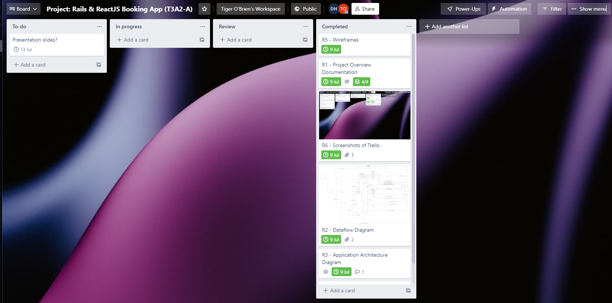

# Further Documentation For T3A2-B

## Adjustments from T3A2-A

During the development phase, we further considered the needs of our hypothetical client against the scope of and time frame for this work. On balance, we made the following adjustments to the app:

- Added 'instrument' to the booking form. Users can select between 'guitar', 'piano' and 'voice' when booking a lesson.
- Minor cosmetic and layout choices.

## Testing

In addition to utilising a formal testing framework and writing test files, we also conducted extensive user testing of both the development site and production site.

## Trello board

Trello board available [here](https://trello.com/b/D6nQq4WS/project-rails-reactjs-booking-app-t3a2-b).

Screenshots below.

